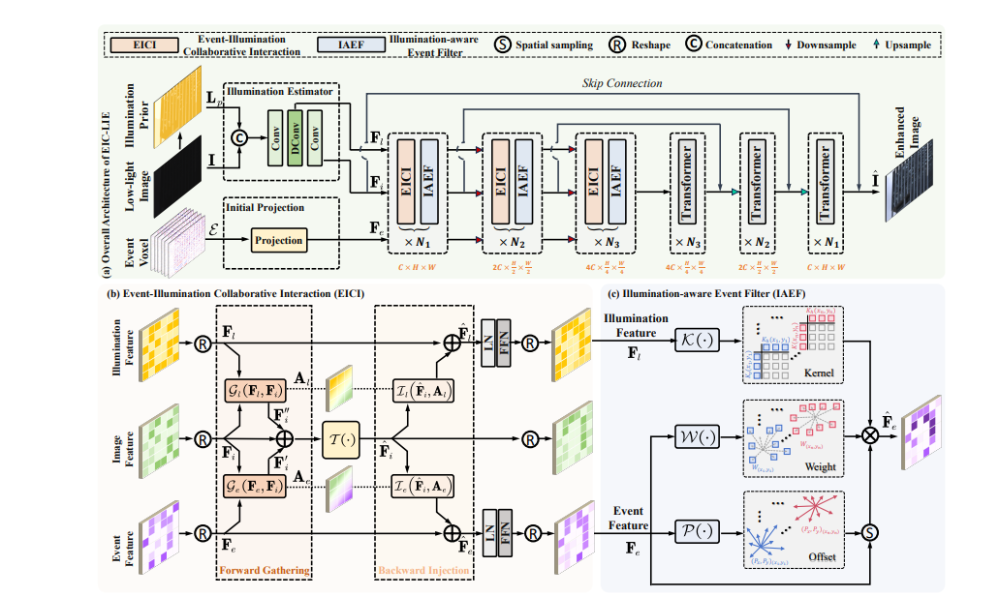

# EIC-LIE: Event-Illumination Collaborative Low-light Image Enhancement [CVPR 2026]

## Event-Illumination Collaborative Low-light Image Enhancement with a High-resolution Real-world Dataset

> Event cameras retain high-dynamic-range structural information in dark scenes, but their output is noisy and does not directly represent global illumination. EIC-LIE jointly models low-light images, illumination, and events. Its Event-Illumination Collaborative Interaction (EICI) module gathers complementary information into the image stream and injects image content back into the event and illumination streams. The Illumination-Aware Event Filter (IAEF) uses image-derived illumination features to suppress unreliable events. The work also introduces RLE, a high-resolution real-world dataset containing synchronized low-light images, reference images, and events.
>
> Experiments on RLE, SDE-indoor, SDE-outdoor, SDSD-indoor, and SDSD-outdoor show that EIC-LIE improves event-based low-light enhancement by up to 1.24 dB PSNR and 0.069 SSIM.

## Overview

This repository provides the PyTorch implementation of **Event-Illumination Collaborative Low-light Image Enhancement with a High-resolution Real-world Dataset**, accepted by CVPR 2026.

This is the overview of our network's architecture:



The implementation details are provided in the
[[paper]](https://openaccess.thecvf.com/content/CVPR2026/html/Xu_Event-Illumination_Collaborative_Low-light_Image_Enhancement_with_a_High-resolution_Real-world_Dataset_CVPR_2026_paper.html) and
[[supplementary]](https://openaccess.thecvf.com/content/CVPR2026/supplemental/Xu_Event-Illumination_Collaborative_Low-light_CVPR_2026_supplemental.pdf).

The released EIC-LIE model has approximately **2.13M parameters**. The repository keeps only the paper model, its data pipeline, training and evaluation code, and the five dataset configurations. Pretrained weights are stored separately.

## Installation

Use the following commands to install the dependencies:

```bash
git clone https://github.com/QUEAHREN/EIC-LIE.git
cd EIC-LIE
conda create -n eiclie python=3.9
conda activate eiclie
conda install pytorch==1.13.0 torchvision==0.14.0 pytorch-cuda=11.6 -c pytorch -c nvidia
pip install -r requirements.txt
```

The supplementary material reports PyTorch 1.8 for the original experiments. The environment above is the tested BitaHub setup based on PyTorch 1.13.0 and CUDA 11.6. When using another CUDA version, install the matching CuPy package.

## Dataset & Data Preprocess

The paper evaluates EIC-LIE on RLE, SDE-indoor, SDE-outdoor, SDSD-indoor, and SDSD-outdoor. RLE contains 7,888 synchronized pairs at `1024 x 768`, including 4,877 training pairs and 3,011 testing pairs.

Each processed sample is stored as an H5 file with the following keys:

```text
image   low-light RGB image
sharp   normal-light ground truth
voxel   six-bin event voxel
```

Replace the `/path/to/datasets/...` placeholders in the selected YAML file
under `options/train` or `options/test`. This repository expects preprocessed
H5 files and does not include raw-data conversion scripts.

## Evaluation

#### Pretrained Model Download

- Pretrained `.pth` files are distributed separately from the code repository.
- A weight file may be stored anywhere because its path is passed directly to `test.sh`.

#### Test

- Set `dataroot` in the corresponding file under `options/test`.
- Test a pretrained model with:

```bash
bash test.sh options/test/EIC-LIE_SDEout.yml /path/to/net_g_best.pth
```

Replace `EIC-LIE_SDEout.yml` with `EIC-LIE_RLE.yml`, `EIC-LIE_SDEin.yml`,
`EIC-LIE_SDSDin.yml`, or `EIC-LIE_SDSDout.yml` for another dataset.

The test pipeline reports PSNR and SSIM. Enhanced images are saved to:

```text
/output/results/<experiment-name>/visualization/<dataset-name>/
```

## Training

- Set the training and validation paths in the corresponding file under `options/train`.
- Start one-GPU training with:

```bash
bash train.sh options/train/EIC-LIE_SDEout.yml
```

Available training configurations are:

```text
EIC-LIE_RLE.yml
EIC-LIE_SDEin.yml
EIC-LIE_SDEout.yml
EIC-LIE_SDSDin.yml
EIC-LIE_SDSDout.yml
```

The paper uses `128 x 128` patches, batch size 24, six event bins, AdamW with betas `(0.9, 0.99)`, and Charbonnier loss. Checkpoints and training states are saved to:

```text
/output/experiments/<experiment-name>/models/
/output/experiments/<experiment-name>/training_states/
```

## Citation

If you find this work useful in your research, please consider citing:

```bibtex
@InProceedings{Xu_2026_CVPR,
    author    = {Xu, Senyan and Sun, Zhijing and Liu, Kean and Lu, Xin and Jiang, Ruixuan and Fu, Xueyang and Zha, Zheng-Jun},
    title     = {Event-Illumination Collaborative Low-light Image Enhancement with a High-resolution Real-world Dataset},
    booktitle = {Proceedings of the IEEE/CVF Conference on Computer Vision and Pattern Recognition (CVPR)},
    month     = {June},
    year      = {2026},
    pages     = {22270--22280}
}
```

## Contact

Should you have any question, please contact [syxu@mail.ustc.edu.cn](mailto:syxu@mail.ustc.edu.cn).

**Acknowledgment:** This code is based on the [BasicSR](https://github.com/xinntao/BasicSR) toolbox.
